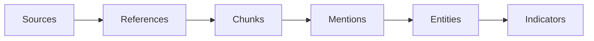

## Foundational concepts

Mallory ingests and processes Open Source Intelligence (OSINT) at scale, transforming publicly available data into structured, actionable intelligence. Thousands of blog posts, advisories, and reports are collected and analyzed daily.

### Sources

**Sources** are where data comes from. Mallory collects from a wide range of open and technical sources: threat reports, advisories, security blogs, paste sites, malware repositories, and social platforms.

<Note>
Example: A Microsoft blog, a VirusTotal feed, or a security researcher's feed can all be source material.
</Note>

### References and content chunks

Each source item is stored as a **Reference** (e.g. a URL to an article or report). A reference contains one or more **Content Chunks**—semantically related segments of the content. Each chunk is analyzed to extract entities, relationships, and insights.

<Note>
Example: A single reference (e.g. a blog post) may have multiple content chunks covering different malware families, campaigns, or IOCs.
</Note>

### Mentions

**Mentions** link **Entities** to the **References** (and content chunks) where they appear. Mallory uses mentions to trace where, when, and how an entity is discussed across the intelligence landscape.

<Note>
Example: If "APT29" and "Sogu malware" appear in the same article, Mallory records both entities as mentioned in that reference.
</Note>

### Entities

**Entities** are the core objects in the threat ecosystem: malware, ransomware, threat actors, vulnerabilities, campaigns, organizations, and more. They are extracted from content and updated continuously with the latest intelligence and relationships.

<Note>
Example: The "LockBit" ransomware entity includes aliases, associated campaigns, targeted industries, and related IOCs.
</Note>

### Indicators

**Indicators** (observables, IOCs) are evidence of potential malicious activity—IP addresses, domains, file hashes, URLs, email addresses. Mallory aggregates and enriches them from multiple sources, correlates them with entities (e.g. malware or threat actors), and tracks activity over time.

<Note>
Example: A file hash tied to a QakBot campaign may link to known C2 IPs, phishing domains, and recent detection activity.
</Note>

## How it fits together

Sources emit references; references are chunked and analyzed; analysis produces mentions that link entities to references; entities are enriched and linked to indicators.

## Learn more

<CardGroup cols={2}>
  <Card title="Use Chat" icon="message" href="/use/chat">
    Query entities and relationships in natural language.
  </Card>
  <Card title="Threat entities" icon="shield" href="/use/entities">
    Browse and search entities in the product.
  </Card>
  <Card title="Indicators" icon="magnifying-glass" href="/use/indicators">
    Use the IOC and observables feed.
  </Card>
  <Card title="API Reference" icon="code" href="/api-reference/introduction">
    Access entities and data via the API.
  </Card>
</CardGroup>
