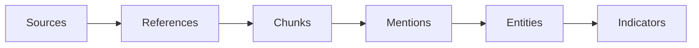

## Foundational Concepts

Mallory ingests and processes Open Source Intelligence (OSINT) at scale, transforming publicly available data into structured, actionable intelligence. Thousands of blog posts, advisories, and reports are collected and analyzed daily.

### Sources

**Sources** are where data comes from. Mallory collects from a wide range of open and technical sources: threat reports, advisories, security blogs, paste sites, malware repositories, and social platforms.

<Note>
Example: A Microsoft blog, a VirusTotal feed, or a security researcher's feed can all be source material.
</Note>

### References and Content Chunks

Each source item is stored as a **Reference** (e.g. a URL to an article or report). A reference contains one or more **Content Chunks**—semantically related segments of the content. Each chunk is analyzed to extract entities, relationships, and insights.

<Note>
Example: A single reference (e.g. a blog post) may have multiple content chunks covering different malware families, campaigns, or IOCs.
</Note>

### Mentions

**Mentions** link **Entities** to the **References** (and content chunks) where they appear. Mallory uses mentions to trace where, when, and how an entity is discussed across the intelligence landscape.

<Note>
Example: If "APT29" and "Sogu malware" appear in the same article, Mallory records both entities as mentioned in that reference.
</Note>

### Entities

**Entities** are the core objects in the threat ecosystem: malware, ransomware, threat actors, vulnerabilities, campaigns, organizations, and more. They are extracted from content and updated continuously with the latest intelligence and relationships.

<Note>
Example: The "LockBit" ransomware entity includes aliases, associated campaigns, targeted industries, and related IOCs.
</Note>

### Indicators

**Indicators** (observables, IOCs) are evidence of potential malicious activity—IP addresses, domains, file hashes, URLs, email addresses. Mallory aggregates and enriches them from multiple sources, correlates them with entities (e.g. malware or threat actors), and tracks activity over time.

<Note>
Example: A file hash tied to a QakBot campaign may link to known C2 IPs, phishing domains, and recent detection activity.
</Note>

## How It Fits Together

Sources emit references; references are chunked and analyzed; analysis produces mentions that link entities to references; entities are enriched and linked to indicators.

### Stories

**Stories** are curated security narratives that group related entities and context from many references into a single, coherent view. Instead of browsing raw articles, you get a story that summarizes a campaign, a CVE, a breach, or another development—with links to underlying entities and sources. Stories are built from references and entities; they provide a narrative summary, key entities, references, a timeline of events when available, and related stories.

### The Feed (Current Events)

**The Feed** (Current Events) is the curated overview of the latest threats and vulnerabilities. Content is sourced from open intelligence, analyzed, and summarized. You see recent high-signal coverage, summaries from multiple sources, and links to underlying references and entities. The feed is built from stories and profile-relevant entities so it reflects the latest relevant developments.

### Agent & Agent Threads

**Agent Threads** is the conversational interface for querying and exploring Mallory's intelligence in natural language. The **Agent** is the AI that powers it, with access to the knowledge base, search tools, report generators, and delivery tools. You can ask about entities, explore relationships, investigate recent activity, get summaries, and request reports—with results deliverable via email or Slack.

### Schedules

**Schedules** let you rerun a prompt on a recurring basis (e.g. daily, weekly) so you get fresh intelligence without opening the app. A schedule is attached to a thread, stores the prompt and recurrence, runs at each run time, and delivers output via Slack or email. Schedules are time-based only (no event-based triggers). You can manage them in the app or via the API.

### Integrations & Delivery

**Integrations & Delivery** cover how Mallory connects to your stack and how intelligence leaves the platform: the REST API, the Integrations API (e.g. Slack, email), bulk exports, and (when available) webhooks. Delivery is how reports and alerts reach you—via email, Slack, or export—so you can act on intelligence where you work.

## Learn More

<CardGroup cols={2}>
  <Card title="Agent Threads" icon="message" href="/use/threads">
    Query entities and relationships in natural language.
  </Card>
  <Card title="Threat Entities" icon="shield" href="/use/entities">
    Browse and search entities in the product.
  </Card>
  <Card title="Observables" icon="magnifying-glass" href="/use/observables">
    Use the IOC and observables feed.
  </Card>
  <Card title="API Reference" icon="code" href="/api-reference/introduction">
    Access entities and data via the API.
  </Card>
</CardGroup>
